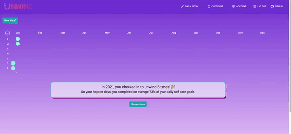

# Unwind

_A nightly ritual self-care PWA to log users’ daily moods and self-care goals to improve mental wellness_

Backend with `Node`/`express`/`sequelize`/`GraphQL` and a frontend with `react`/`redux`/`d3`

## App Walkthrough

* Sign up and choose three daily self care goals


* Check in daily to log mood, journal, and compliment


* Calendar View and analyses of daily user info

**desktop**



**mobile**


* Update account settings


## Local Setup

Fork & clone this repo and then

* Run the following commands:
* `npm install`
* Create two postgres databases

```
createdb $Unwind
createdb $Unwind-test
```

* `npm run seed` for some seed data

## Start

Running `npm run start-dev` will make great things happen!

If you want to run the server and/or `webpack` separately, you can also
`npm run start-server` and `npm run build-client`.

Enjoy!
